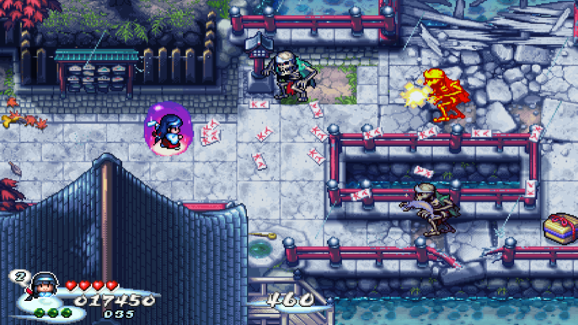

#Image Resolution Pruner
- The pruner takes a image and coverts it into a Image tree (using linked list structure) of RBP pixel object 
- When given a resolution parameter, it will reduce the resolution of the current piction linked-list
 to a lower resolution through taking the average of colors in an area
- example (before):
- example (after): 
